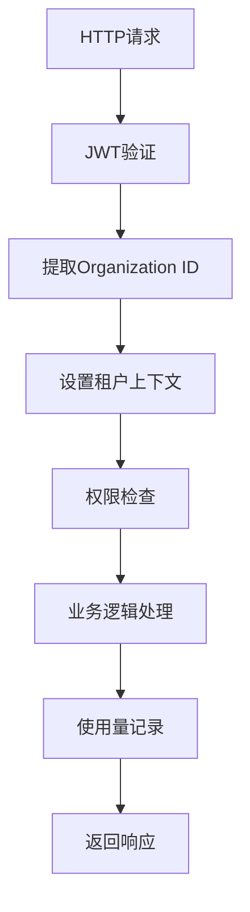

# Keycloak 26 Organization Management 多租户实施方案

## 📋 **技术可行性评估**

### ✅ **优势**
1. **标准化身份管理**：无需自建租户认证，使用成熟的Keycloak组织管理
2. **JWT原生支持**：Organization ID自动注入Token，减少自定义Claims开发
3. **企业级特性**：SSO、MFA、用户联邦、细粒度权限控制开箱即用
4. **降低开发成本**：专注业务逻辑，身份管理交给Keycloak
5. **高可用性**：Keycloak集群支持，满足企业级可用性要求

### ⚠️ **挑战**
1. **基础设施复杂度**：需要维护独立的Keycloak集群
2. **学习曲线**：团队需要熟悉Keycloak配置和管理
3. **依赖性风险**：核心认证依赖外部服务
4. **版本兼容性**：需要确保Keycloak 26+版本稳定性

## 🏗️ **详细实施方案**

### 1. **Keycloak Organization配置**

#### 1.1 组织结构设计
```json
{
  "organization": {
    "id": "org-uuid-123",
    "name": "acme-corp",
    "displayName": "Acme Corporation", 
    "attributes": {
      "subscription_plan": "enterprise",
      "max_agents": "100",
      "max_conversations_monthly": "50000",
      "max_api_calls_monthly": "500000",
      "max_storage_mb": "10240",
      "features": ["sso", "api_access", "webhooks", "analytics"],
      "billing_email": "billing@acme.com",
      "created_at": "2025-01-01T00:00:00Z"
    }
  }
}
```

#### 1.2 组织角色定义
- **org-owner**: 组织所有者，全部权限
- **org-admin**: 组织管理员，管理用户和配置
- **org-member**: 普通成员，使用Agent服务
- **org-viewer**: 只读权限，查看统计和配置

#### 1.3 JWT Token映射配置
```json
{
  "protocol_mappers": [
    {
      "name": "organization-id-mapper",
      "protocol": "openid-connect",
      "protocolMapper": "oidc-audience-mapper",
      "config": {
        "claim.name": "organization_id",
        "claim.value": "${organization.id}",
        "access.token.claim": "true",
        "id.token.claim": "true"
      }
    },
    {
      "name": "organization-roles-mapper", 
      "protocol": "openid-connect",
      "protocolMapper": "oidc-organization-membership-mapper",
      "config": {
        "claim.name": "organization_roles",
        "access.token.claim": "true"
      }
    }
  ]
}
```

### 2. **应用层集成实现**

#### 2.1 中间件集成流程


#### 2.2 核心服务注册
```csharp
// Program.cs 或 Startup.cs
services.AddKeycloakMultiTenant(configuration)
    .AddScoped<ISubscriptionLimitService, SubscriptionLimitService>()
    .AddScoped<IUsageTrackingService, UsageTrackingService>()
    .AddScoped<ISubscriptionService, SubscriptionService>();

// 注册限制检查Hook
services.AddScoped<IAgentHook, SubscriptionLimitHook>();
services.AddScoped<IConversationHook, SubscriptionLimitHook>();
```

### 3. **订阅限制详细机制**

#### 3.1 实时限制检查策略

##### **Agent创建限制**
```csharp
// 检查流程
1. 提取当前租户ID (从JWT Token的organization_id)
2. 查询租户当前订阅计划
3. 获取当前Agent数量
4. 对比计划限制
5. 允许/拒绝操作
6. 记录使用量
```

##### **对话限制检查**
```csharp
// 月度重置机制
- 每月1号凌晨自动重置对话计数
- 实时检查当月对话数量
- 支持预付费和后付费模式
- 超限后可选择升级或暂停服务
```

##### **API调用限制**
```csharp
// 分级限制策略
- 免费版：1,000次/月
- 专业版：50,000次/月  
- 企业版：无限制
- 超限处理：返回429状态码，提示升级
```

##### **存储空间管理**
```csharp
// 文件上传前检查
1. 计算当前存储使用量
2. 预估上传后总使用量
3. 检查是否超出计划限制
4. 支持单文件大小限制
5. 自动清理临时文件
```

#### 3.2 使用量统计架构

##### **实时统计表设计**
```sql
CREATE TABLE tenant_usage_stats (
    tenant_id VARCHAR(255) PRIMARY KEY,
    agents_created INT DEFAULT 0,
    conversations_this_month INT DEFAULT 0,
    api_calls_this_month INT DEFAULT 0,
    storage_used_mb BIGINT DEFAULT 0,
    last_updated TIMESTAMP DEFAULT CURRENT_TIMESTAMP,
    month_year VARCHAR(7) -- 格式: 2025-01
);

CREATE TABLE usage_records (
    id UUID PRIMARY KEY,
    tenant_id VARCHAR(255) NOT NULL,
    usage_type VARCHAR(50) NOT NULL,
    quantity INT NOT NULL,
    metadata JSONB,
    created_at TIMESTAMP DEFAULT CURRENT_TIMESTAMP
);

CREATE INDEX idx_usage_records_tenant_time 
ON usage_records(tenant_id, created_at);
```

##### **使用量记录策略**
```csharp
// 异步记录机制
1. 业务操作成功后异步记录使用量
2. 使用消息队列避免阻塞主流程
3. 批量写入优化性能
4. 定期聚合统计数据
5. 支持使用量审计和回滚
```

### 4. **配置文件示例**

#### 4.1 appsettings.json
```json
{
  "Keycloak": {
    "Authority": "https://keycloak.yourdomain.com/realms/botsharp",
    "Audience": "botsharp-api",
    "ClientId": "botsharp-client",
    "ClientSecret": "your-client-secret",
    "RequireHttpsMetadata": true,
    "AdminApiUrl": "https://keycloak.yourdomain.com",
    "AdminUsername": "admin",
    "AdminPassword": "admin-password",
    "Realm": "botsharp"
  },
  "SubscriptionPlans": {
    "Free": {
      "MaxAgents": 1,
      "MaxConversationsPerMonth": 100,
      "MaxAPICallsPerMonth": 1000,
      "MaxStorageMB": 100,
      "Features": ["basic_templates", "community_support"]
    },
    "Pro": {
      "MaxAgents": 10,
      "MaxConversationsPerMonth": 5000,
      "MaxAPICallsPerMonth": 50000,
      "MaxStorageMB": 1000,
      "Features": ["advanced_templates", "api_access", "email_support"]
    },
    "Enterprise": {
      "MaxAgents": -1,
      "MaxConversationsPerMonth": -1,
      "MaxAPICallsPerMonth": -1,
      "MaxStorageMB": -1,
      "Features": ["all_templates", "sso", "priority_support", "white_label"]
    }
  }
}
```

### 5. **错误处理和用户体验**

#### 5.1 友好的限制提示
```json
{
  "error": {
    "code": "SUBSCRIPTION_LIMIT_EXCEEDED",
    "message": "您已达到当前计划的Agent数量限制",
    "details": {
      "limit_type": "max_agents",
      "current_value": 5,
      "limit_value": 5,
      "plan_name": "专业版"
    },
    "suggestions": [
      {
        "action": "upgrade_plan",
        "title": "升级到企业版",
        "description": "获得无限Agent数量",
        "url": "/billing/upgrade"
      },
      {
        "action": "delete_unused",
        "title": "删除未使用的Agent",
        "description": "释放额度创建新Agent",
        "url": "/agents/manage"
      }
    ]
  }
}
```

#### 5.2 使用量仪表板
```typescript
interface UsageDashboard {
  tenantInfo: {
    name: string;
    plan: string;
    billingCycle: string;
  };
  currentUsage: {
    agents: { used: number; limit: number; percentage: number };
    conversations: { used: number; limit: number; remaining: number };
    apiCalls: { used: number; limit: number; resetDate: string };
    storage: { used: number; limit: number; unit: string };
  };
  alerts: Array<{
    type: 'warning' | 'error' | 'info';
    message: string;
    action?: string;
  }>;
}
```

### 6. **监控和告警**

#### 6.1 关键指标监控
- 租户使用量趋势
- 接近限制的租户列表
- 订阅计划转换率
- 系统资源使用情况
- Keycloak服务健康状态

#### 6.2 自动化告警规则
```yaml
alerts:
  - name: tenant_approaching_limit
    condition: usage_percentage > 80
    actions: [email_notification, slack_alert]
  
  - name: subscription_expiring
    condition: days_until_expiry < 7
    actions: [renewal_reminder, account_manager_notification]
  
  - name: keycloak_service_down
    condition: keycloak_health_check_failed
    actions: [pagerduty_alert, emergency_notification]
```

## 🚀 **实施路线图**

### Phase 1: 基础架构 (4-6周)
1. Keycloak 26 部署和配置
2. Organization结构设计
3. JWT Token映射配置
4. 基础中间件开发

### Phase 2: 核心功能 (6-8周)
1. 订阅限制服务开发
2. 使用量跟踪系统
3. 权限检查Hook实现
4. 基础仪表板开发

### Phase 3: 优化完善 (4-6周)
1. 性能优化和缓存
2. 监控告警系统
3. 用户体验优化
4. 安全性加固

### Phase 4: 上线准备 (2-4周)
1. 压力测试和调优
2. 文档完善
3. 运维流程建立
4. 灰度发布

## 📊 **预期收益**

### 技术收益
- **开发效率提升 40%**：减少身份管理相关开发
- **系统稳定性提升**：基于成熟的Keycloak架构
- **安全性增强**：企业级身份管理最佳实践

### 业务收益
- **用户体验改善**：统一的身份认证体验
- **运营效率提升**：自动化的订阅管理
- **收入增长潜力**：清晰的付费升级路径

这个方案充分利用了Keycloak 26的Organization Management功能，通过标准化的身份管理和精细化的订阅控制，为BotSharp提供了企业级的多租户SaaS基础架构。
