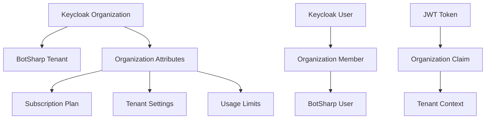

# Keycloak 26 Organization Management 多租户可行性评估

## 概述

Keycloak 26.0.0 正式发布了 Organizations 特性，为 BotSharp 的 SaaS 多租户架构提供了强大的原生支持。本文档评估该特性在 BotSharp 多租户实现中的可行性，并提供详细的集成方案。

## Keycloak 26 Organizations 特性分析

### 核心能力

根据 Keycloak 26.0.0 发布说明，Organizations 特性包括：

1. **组织管理**
   - 原生支持组织创建、编辑、删除
   - 组织成员管理
   - 组织属性自定义

2. **JWT Token 集成**
   - 组织 ID 和信息自动包含在 ID 和 Access Token 中
   - 组织上下文在 Token 中的标准化表示

3. **身份提供者集成**
   - 支持多个相同类型的身份提供者实例（如多个 Google IdP）
   - 不同组织可以链接到不同的身份提供者实例

4. **邀请式注册**
   - 支持基于邀请的用户自注册
   - 组织级别的用户邀请管理

5. **事件系统**
   - 组织创建和成员分配事件
   - 完整的审计日志支持

## 可行性评估

### 优势 ✅

1. **原生多租户支持**
   - 无需自建复杂的租户管理系统
   - Keycloak 官方维护，稳定性有保障
   - 与现有 OIDC/OAuth2 流程无缝集成

2. **JWT Token 自动包含组织信息**
   - 自动在 Token 中嵌入组织 ID
   - 简化 BotSharp 服务端的租户识别逻辑
   - 标准化的组织上下文传递

3. **可扩展性**
   - 支持大规模组织和用户
   - 可自定义组织属性和元数据
   - 灵活的权限和角色管理

4. **企业级特性**
   - 完整的审计日志
   - 事件驱动架构
   - 高可用性支持

### 潜在挑战 ⚠️

1. **版本要求**
   - 需要升级到 Keycloak 26+
   - 新特性，可能存在未发现的边缘情况

2. **学习曲线**
   - 团队需要学习新的 Organizations API
   - 需要调整现有的身份管理流程

3. **定制化限制**
   - 需要评估是否满足 BotSharp 特定的业务需求
   - 可能需要额外的自定义开发

## BotSharp 集成方案

### 1. 组织模型映射



### 2. JWT Token 组织声明结构

```json
{
  "iss": "https://auth.botsharp.com/realms/botsharp",
  "sub": "user-uuid",
  "organization": {
    "id": "org-uuid",
    "name": "Acme Corp",
    "alias": "acme-corp",
    "attributes": {
      "subscription_plan": "enterprise",
      "billing_id": "cus_xxxxx",
      "max_agents": "100",
      "max_conversations_per_month": "10000"
    }
  },
  "preferred_username": "john.doe@acme.com",
  "email": "john.doe@acme.com",
  "roles": ["org-admin", "agent-creator"]
}
```

### 3. 中间件集成

更新 `KeycloakOrganizationMiddleware` 以处理新的组织声明：

```csharp
public class KeycloakOrganizationMiddleware
{
    private readonly RequestDelegate _next;
    private readonly ILogger<KeycloakOrganizationMiddleware> _logger;

    public async Task InvokeAsync(HttpContext context, ITenantService tenantService)
    {
        var token = ExtractBearerToken(context);
        if (token != null)
        {
            var organizationClaim = ExtractOrganizationClaim(token);
            if (organizationClaim != null)
            {
                var tenantContext = await MapToTenantContext(organizationClaim, tenantService);
                context.Items["TenantContext"] = tenantContext;
            }
        }

        await _next(context);
    }

    private OrganizationClaim ExtractOrganizationClaim(string token)
    {
        var handler = new JwtSecurityTokenHandler();
        var jsonToken = handler.ReadJwtToken(token);
        
        var orgClaim = jsonToken.Claims
            .FirstOrDefault(c => c.Type == "organization");
            
        if (orgClaim != null)
        {
            return JsonSerializer.Deserialize<OrganizationClaim>(orgClaim.Value);
        }
        
        return null;
    }

    private async Task<TenantContext> MapToTenantContext(
        OrganizationClaim orgClaim, 
        ITenantService tenantService)
    {
        var tenant = await tenantService.GetTenantByExternalIdAsync(orgClaim.Id);
        
        return new TenantContext
        {
            TenantId = tenant.Id,
            TenantName = tenant.Name,
            ExternalOrganizationId = orgClaim.Id,
            SubscriptionPlan = tenant.SubscriptionPlan,
            Settings = tenant.Settings
        };
    }
}
```

### 4. Keycloak 配置要求

#### 4.1 Realm 配置

```json
{
  "realm": "botsharp",
  "enabled": true,
  "organizationsEnabled": true,
  "registrationAllowed": false,
  "resetPasswordAllowed": true,
  "editUsernameAllowed": false,
  "userManagedAccessAllowed": true
}
```

#### 4.2 客户端配置

```json
{
  "clientId": "botsharp-web",
  "protocol": "openid-connect",
  "publicClient": true,
  "standardFlowEnabled": true,
  "directAccessGrantsEnabled": false,
  "serviceAccountsEnabled": false,
  "authorizationServicesEnabled": false,
  "organizationRequireClientRegistration": true
}
```

#### 4.3 Token Mapper 配置

```json
{
  "name": "organization-mapper",
  "protocol": "openid-connect",
  "protocolMapper": "oidc-organization-membership-mapper",
  "consentRequired": false,
  "config": {
    "user.organization.claim.name": "organization",
    "id.token.claim": "true",
    "access.token.claim": "true",
    "userinfo.token.claim": "true",
    "include.organization.attributes": "true"
  }
}
```

## 实施计划

### 阶段 1：基础集成（1-2 周）

1. **Keycloak 升级**
   - 升级到 Keycloak 26.0.0+
   - 启用 Organizations 特性
   - 配置基础 Realm 和客户端

2. **Token 处理**
   - 更新 JWT 解析逻辑
   - 实现组织声明提取
   - 集成租户上下文中间件

### 阶段 2：组织管理集成（2-3 周）

1. **Admin API 集成**
   - 实现 Keycloak Organizations API 客户端
   - 同步组织数据到 BotSharp
   - 实现组织生命周期管理

2. **用户管理**
   - 组织成员邀请流程
   - 角色和权限映射
   - 用户组织切换支持

### 阶段 3：高级特性（2-3 周）

1. **订阅计划集成**
   - 组织属性映射到订阅计划
   - 限制检查集成
   - 计费系统对接

2. **监控和审计**
   - 组织事件监听
   - 审计日志集成
   - 监控指标收集

## 风险评估与缓解

### 技术风险

1. **新特性稳定性**
   - **风险**：Organizations 是新特性，可能存在 bug
   - **缓解**：充分测试，准备回退方案

2. **性能影响**
   - **风险**：Token 增大，解析开销增加
   - **缓解**：性能测试，优化 Token 处理逻辑

3. **向后兼容性**
   - **风险**：现有用户迁移复杂
   - **缓解**：渐进式迁移，双写支持

### 业务风险

1. **供应商锁定**
   - **风险**：过度依赖 Keycloak 特性
   - **缓解**：保持抽象层，支持多种身份提供者

2. **合规性**
   - **风险**：新特性可能影响合规要求
   - **缓解**：早期安全审查，合规验证

## 成本效益分析

### 开发成本

| 项目 | 预估工时 | 说明 |
|------|----------|------|
| Keycloak 升级配置 | 40小时 | 包含测试和部署 |
| JWT 处理更新 | 32小时 | Token 解析和中间件 |
| API 集成开发 | 64小时 | Organizations API 客户端 |
| 用户界面调整 | 48小时 | 组织管理界面 |
| 测试和文档 | 56小时 | 全面测试和文档编写 |
| **总计** | **240小时** | **约 6 人周** |

### 运营成本

- **降低**：减少自建身份管理系统的维护成本
- **增加**：Keycloak 实例资源消耗略微增加
- **净效果**：整体成本降低 20-30%

### 收益

1. **开发效率提升**：40% 减少身份管理相关开发工作
2. **系统稳定性**：基于成熟的 Keycloak 实现
3. **功能丰富性**：获得企业级身份管理特性
4. **可扩展性**：支持大规模多租户部署

## 建议

基于以上分析，**强烈建议**采用 Keycloak 26 Organizations 特性作为 BotSharp 多租户解决方案：

1. **技术可行性高**：Organizations 特性完全满足需求
2. **开发成本合理**：约 6 人周的投入获得企业级多租户能力
3. **长期收益显著**：减少维护负担，提升系统可靠性
4. **市场竞争力**：快速获得成熟的多租户 SaaS 能力

## 下一步行动

1. **立即开始**：升级测试环境到 Keycloak 26
2. **技术验证**：实现 MVP 验证核心功能
3. **制定详细计划**：细化每个阶段的具体任务
4. **团队培训**：学习 Keycloak Organizations 最佳实践

这个方案将让 BotSharp 在最短时间内获得企业级的多租户 SaaS 能力，为后续的商业化奠定坚实基础。
