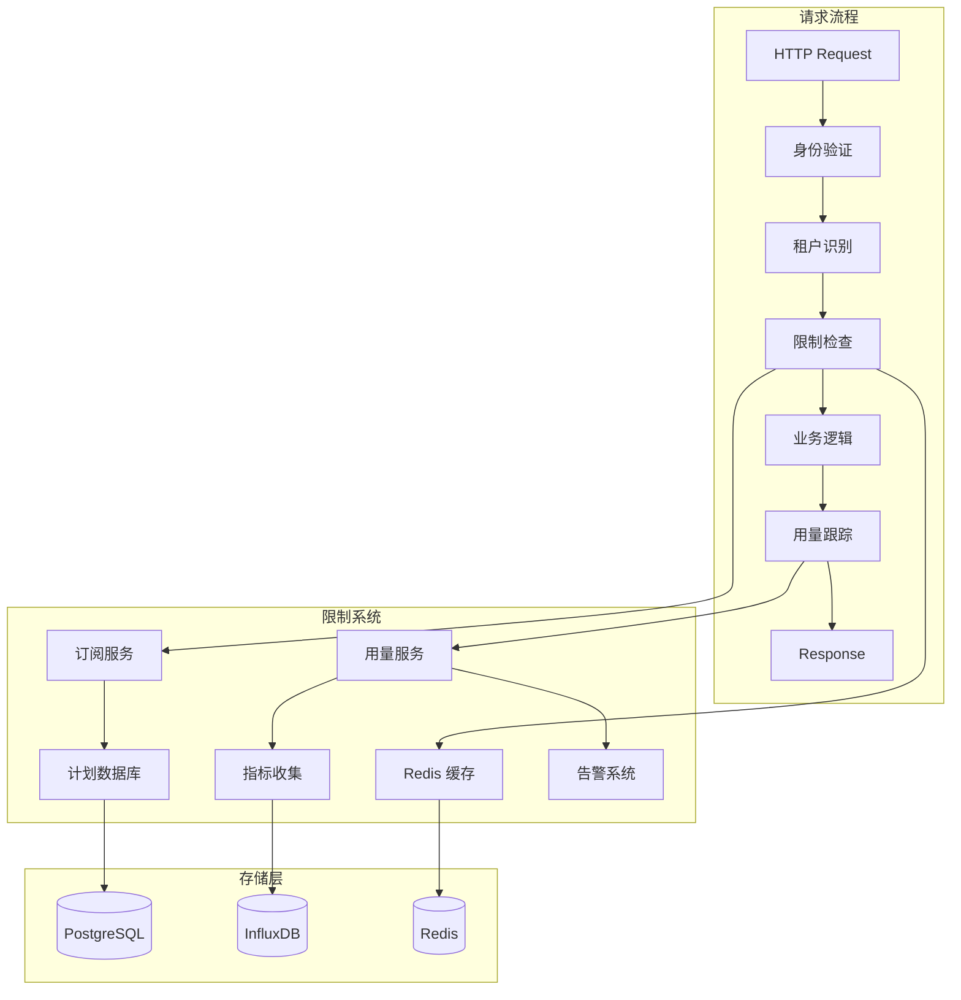

# BotSharp SaaS 订阅计划限制实施技术方案

## 概述

本文档详细描述了 BotSharp SaaS 平台的订阅计划限制系统的技术实施方案，包括限制类型、检查机制、用量统计、告警监控等关键组件的具体实现。

## 架构总览



## 限制类型详细设计

### 1. 硬限制（Hard Limits）

硬限制会立即阻止操作继续执行：

```csharp
public class HardLimitChecker : ILimitChecker
{
    public async Task<LimitCheckResult> CheckAsync(LimitContext context)
    {
        var currentUsage = await _usageService.GetCurrentUsageAsync(
            context.TenantId, context.Resource, context.TimeWindow);
            
        var limit = await _subscriptionService.GetLimitAsync(
            context.TenantId, context.Resource);
            
        if (currentUsage >= limit.Value)
        {
            return LimitCheckResult.Denied(
                $"Hard limit exceeded: {currentUsage}/{limit.Value}",
                limit.ResetTime);
        }
        
        return LimitCheckResult.Allowed();
    }
}
```

### 2. 软限制（Soft Limits）

软限制发出警告但允许操作继续：

```csharp
public class SoftLimitChecker : ILimitChecker
{
    public async Task<LimitCheckResult> CheckAsync(LimitContext context)
    {
        var currentUsage = await _usageService.GetCurrentUsageAsync(
            context.TenantId, context.Resource, context.TimeWindow);
            
        var limit = await _subscriptionService.GetLimitAsync(
            context.TenantId, context.Resource);
            
        var warningThreshold = limit.Value * 0.8m; // 80% 警告阈值
        
        if (currentUsage >= warningThreshold)
        {
            // 异步发送警告通知
            _ = Task.Run(() => _alertService.SendWarningAsync(
                context.TenantId, context.Resource, currentUsage, limit.Value));
                
            return LimitCheckResult.Warning(
                $"Approaching limit: {currentUsage}/{limit.Value}",
                currentUsage / (decimal)limit.Value);
        }
        
        return LimitCheckResult.Allowed();
    }
}
```

### 3. 计量限制（Metered Limits）

基于计量单位的限制：

```csharp
public class MeteredLimitChecker : ILimitChecker
{
    public async Task<LimitCheckResult> CheckAsync(LimitContext context)
    {
        var subscription = await _subscriptionService.GetSubscriptionAsync(context.TenantId);
        
        // 检查账户余额
        if (subscription.Credits <= 0)
        {
            return LimitCheckResult.Denied(
                "Insufficient credits. Please add credits to continue.",
                subscription.NextBillingDate);
        }
        
        // 检查费率限制
        var estimatedCost = await _pricingService.EstimateCostAsync(context);
        if (estimatedCost > subscription.Credits)
        {
            return LimitCheckResult.Warning(
                $"Operation will consume {estimatedCost} credits. Current balance: {subscription.Credits}",
                (decimal)subscription.Credits / estimatedCost);
        }
        
        return LimitCheckResult.Allowed();
    }
}
```

## 核心服务实现

### 1. 增强版订阅限制服务

```csharp
public class AdvancedSubscriptionLimitService : ISubscriptionLimitService
{
    private readonly IMemoryCache _cache;
    private readonly IDistributedCache _distributedCache;
    private readonly ISubscriptionRepository _subscriptionRepo;
    private readonly IUsageRepository _usageRepo;
    private readonly ILogger<AdvancedSubscriptionLimitService> _logger;
    private readonly IServiceProvider _serviceProvider;

    // 限制检查器映射
    private readonly Dictionary<LimitType, Type> _checkerTypes = new()
    {
        { LimitType.Hard, typeof(HardLimitChecker) },
        { LimitType.Soft, typeof(SoftLimitChecker) },
        { LimitType.Metered, typeof(MeteredLimitChecker) },
        { LimitType.RateLimit, typeof(RateLimitChecker) },
        { LimitType.Concurrent, typeof(ConcurrentLimitChecker) }
    };

    public async Task<LimitCheckResult> CheckLimitAsync(
        string tenantId, 
        string resource, 
        int requestedAmount = 1,
        Dictionary<string, object> context = null)
    {
        try
        {
            // 1. 获取订阅计划
            var subscription = await GetSubscriptionWithCachingAsync(tenantId);
            if (subscription == null)
            {
                return LimitCheckResult.Denied("No active subscription found");
            }

            // 2. 获取资源限制配置
            var limitConfig = await GetLimitConfigAsync(subscription.PlanId, resource);
            if (limitConfig == null)
            {
                return LimitCheckResult.Allowed(); // 无限制配置默认允许
            }

            // 3. 创建限制上下文
            var limitContext = new LimitContext
            {
                TenantId = tenantId,
                Resource = resource,
                RequestedAmount = requestedAmount,
                TimeWindow = limitConfig.TimeWindow,
                LimitConfig = limitConfig,
                Subscription = subscription,
                AdditionalContext = context ?? new Dictionary<string, object>()
            };

            // 4. 执行限制检查
            var results = new List<LimitCheckResult>();
            foreach (var limitType in limitConfig.LimitTypes)
            {
                var checker = CreateLimitChecker(limitType);
                var result = await checker.CheckAsync(limitContext);
                results.Add(result);
                
                // 如果有拒绝结果，立即返回
                if (result.IsBlocked)
                {
                    await LogLimitViolationAsync(limitContext, result);
                    return result;
                }
            }

            // 5. 合并检查结果
            var finalResult = MergeResults(results);
            
            // 6. 记录检查日志
            await LogLimitCheckAsync(limitContext, finalResult);
            
            return finalResult;
        }
        catch (Exception ex)
        {
            _logger.LogError(ex, "Error checking limit for tenant {TenantId}, resource {Resource}", 
                tenantId, resource);
            
            // 发生错误时采用宽松策略，允许操作但记录错误
            return LimitCheckResult.Allowed("Error occurred during limit check, allowing operation");
        }
    }

    private async Task<Subscription> GetSubscriptionWithCachingAsync(string tenantId)
    {
        var cacheKey = $"subscription:{tenantId}";
        
        // 先尝试内存缓存
        if (_cache.TryGetValue(cacheKey, out Subscription cachedSubscription))
        {
            return cachedSubscription;
        }
        
        // 再尝试分布式缓存
        var cachedJson = await _distributedCache.GetStringAsync(cacheKey);
        if (!string.IsNullOrEmpty(cachedJson))
        {
            var subscription = JsonSerializer.Deserialize<Subscription>(cachedJson);
            _cache.Set(cacheKey, subscription, TimeSpan.FromMinutes(5));
            return subscription;
        }
        
        // 从数据库加载
        var dbSubscription = await _subscriptionRepo.GetByTenantIdAsync(tenantId);
        if (dbSubscription != null)
        {
            // 缓存到分布式缓存和内存缓存
            var serialized = JsonSerializer.Serialize(dbSubscription);
            await _distributedCache.SetStringAsync(cacheKey, serialized, 
                new DistributedCacheEntryOptions
                {
                    SlidingExpiration = TimeSpan.FromMinutes(30),
                    AbsoluteExpirationRelativeToNow = TimeSpan.FromHours(2)
                });
            
            _cache.Set(cacheKey, dbSubscription, TimeSpan.FromMinutes(5));
        }
        
        return dbSubscription;
    }

    private ILimitChecker CreateLimitChecker(LimitType limitType)
    {
        if (_checkerTypes.TryGetValue(limitType, out var checkerType))
        {
            return (ILimitChecker)_serviceProvider.GetRequiredService(checkerType);
        }
        
        throw new NotSupportedException($"Limit type {limitType} is not supported");
    }

    private LimitCheckResult MergeResults(List<LimitCheckResult> results)
    {
        // 如果有任何阻塞结果，返回第一个阻塞结果
        var blocked = results.FirstOrDefault(r => r.IsBlocked);
        if (blocked != null)
        {
            return blocked;
        }
        
        // 如果有警告结果，合并所有警告
        var warnings = results.Where(r => r.IsWarning).ToList();
        if (warnings.Any())
        {
            var combinedMessage = string.Join("; ", warnings.Select(w => w.Message));
            var maxUsageRatio = warnings.Max(w => w.UsageRatio);
            return LimitCheckResult.Warning(combinedMessage, maxUsageRatio);
        }
        
        // 全部允许
        return LimitCheckResult.Allowed();
    }
}
```

### 2. 实时用量跟踪服务

```csharp
public class RealtimeUsageTrackingService : IUsageTrackingService
{
    private readonly IDistributedCache _cache;
    private readonly IMessageQueue _messageQueue;
    private readonly IUsageRepository _repository;
    private readonly ILogger<RealtimeUsageTrackingService> _logger;
    
    // 批量写入配置
    private const int BATCH_SIZE = 100;
    private const int FLUSH_INTERVAL_SECONDS = 30;
    
    private readonly ConcurrentDictionary<string, UsageBatch> _pendingWrites = new();
    private readonly Timer _flushTimer;

    public RealtimeUsageTrackingService(...)
    {
        _flushTimer = new Timer(FlushPendingWrites, null, 
            TimeSpan.FromSeconds(FLUSH_INTERVAL_SECONDS), 
            TimeSpan.FromSeconds(FLUSH_INTERVAL_SECONDS));
    }

    public async Task TrackUsageAsync(string tenantId, string resource, 
        int amount = 1, Dictionary<string, object> metadata = null)
    {
        try
        {
            var usageRecord = new UsageRecord
            {
                TenantId = tenantId,
                Resource = resource,
                Amount = amount,
                Timestamp = DateTimeOffset.UtcNow,
                Metadata = metadata ?? new Dictionary<string, object>()
            };

            // 1. 立即更新缓存计数器
            await UpdateCacheCountersAsync(tenantId, resource, amount);
            
            // 2. 添加到批量写入队列
            AddToPendingWrites(usageRecord);
            
            // 3. 检查是否需要触发告警
            await CheckAndTriggerAlertsAsync(tenantId, resource);
            
            // 4. 发送实时事件
            await PublishUsageEventAsync(usageRecord);
        }
        catch (Exception ex)
        {
            _logger.LogError(ex, "Error tracking usage for tenant {TenantId}, resource {Resource}", 
                tenantId, resource);
        }
    }

    private async Task UpdateCacheCountersAsync(string tenantId, string resource, int amount)
    {
        var tasks = new List<Task>();
        
        // 更新多个时间窗口的计数器
        var timeWindows = new[]
        {
            ("hourly", TimeSpan.FromHours(1)),
            ("daily", TimeSpan.FromDays(1)),
            ("monthly", TimeSpan.FromDays(30)),
            ("weekly", TimeSpan.FromDays(7))
        };

        foreach (var (window, timespan) in timeWindows)
        {
            var cacheKey = $"usage:{tenantId}:{resource}:{window}";
            tasks.Add(IncrementCacheCounterAsync(cacheKey, amount, timespan));
        }
        
        await Task.WhenAll(tasks);
    }

    private async Task IncrementCacheCounterAsync(string cacheKey, int amount, TimeSpan expiry)
    {
        try
        {
            // 使用 Redis 原子操作
            var script = @"
                local current = redis.call('get', KEYS[1])
                if current == false then
                    current = 0
                else
                    current = tonumber(current)
                end
                
                local new_value = current + tonumber(ARGV[1])
                redis.call('set', KEYS[1], new_value)
                redis.call('expire', KEYS[1], ARGV[2])
                return new_value
            ";
            
            // 这里需要实际的 Redis 客户端实现
            // await _redisClient.EvaluateAsync(script, cacheKey, amount, expiry.TotalSeconds);
        }
        catch (Exception ex)
        {
            _logger.LogWarning(ex, "Failed to update cache counter {CacheKey}", cacheKey);
        }
    }

    private void AddToPendingWrites(UsageRecord record)
    {
        var batchKey = $"{record.TenantId}:{record.Resource}";
        
        _pendingWrites.AddOrUpdate(batchKey,
            new UsageBatch { Records = new List<UsageRecord> { record } },
            (key, existing) =>
            {
                lock (existing.Records)
                {
                    existing.Records.Add(record);
                }
                return existing;
            });
    }

    private async void FlushPendingWrites(object state)
    {
        try
        {
            var batches = new List<(string key, UsageBatch batch)>();
            
            // 获取所有待写入的批次
            foreach (var kvp in _pendingWrites)
            {
                if (_pendingWrites.TryRemove(kvp.Key, out var batch))
                {
                    batches.Add((kvp.Key, batch));
                }
            }

            if (!batches.Any()) return;

            // 并行写入数据库
            var tasks = batches.Select(async b =>
            {
                try
                {
                    await _repository.BulkInsertAsync(b.batch.Records);
                }
                catch (Exception ex)
                {
                    _logger.LogError(ex, "Failed to flush usage batch for {BatchKey}", b.key);
                    
                    // 写入失败时重新加入队列
                    _pendingWrites.TryAdd(b.key, b.batch);
                }
            });

            await Task.WhenAll(tasks);
            
            _logger.LogDebug("Flushed {BatchCount} usage batches to database", batches.Count);
        }
        catch (Exception ex)
        {
            _logger.LogError(ex, "Error during usage flush");
        }
    }

    public async Task<int> GetCurrentUsageAsync(string tenantId, string resource, 
        TimeSpan timeWindow)
    {
        var windowKey = GetTimeWindowKey(timeWindow);
        var cacheKey = $"usage:{tenantId}:{resource}:{windowKey}";
        
        var cachedValue = await _cache.GetStringAsync(cacheKey);
        if (int.TryParse(cachedValue, out var usage))
        {
            return usage;
        }
        
        // 缓存未命中，从数据库查询
        var startTime = DateTimeOffset.UtcNow.Subtract(timeWindow);
        var dbUsage = await _repository.GetUsageAsync(tenantId, resource, startTime);
        
        // 回写缓存
        await _cache.SetStringAsync(cacheKey, dbUsage.ToString(), 
            new DistributedCacheEntryOptions
            {
                SlidingExpiration = TimeSpan.FromMinutes(5)
            });
        
        return dbUsage;
    }

    private string GetTimeWindowKey(TimeSpan timeWindow)
    {
        return timeWindow.TotalHours switch
        {
            1 => "hourly",
            24 => "daily",
            168 => "weekly", // 7 days
            720 => "monthly", // 30 days
            _ => $"custom_{timeWindow.TotalMinutes}m"
        };
    }
}
```

### 3. 智能告警系统

```csharp
public class IntelligentAlertService : IAlertService
{
    private readonly INotificationService _notificationService;
    private readonly ISubscriptionService _subscriptionService;
    private readonly IUsageRepository _usageRepository;
    private readonly ILogger<IntelligentAlertService> _logger;
    
    // 告警去重缓存
    private readonly IMemoryCache _alertDeduplicationCache;
    
    // 告警阈值配置
    private readonly AlertThresholds _thresholds = new()
    {
        WarningThreshold = 0.8m,
        CriticalThreshold = 0.95m,
        DangerThreshold = 1.0m
    };

    public async Task CheckAndSendAlertsAsync(string tenantId, string resource)
    {
        try
        {
            var subscription = await _subscriptionService.GetSubscriptionAsync(tenantId);
            var limits = await _subscriptionService.GetLimitsAsync(subscription.PlanId);
            
            var resourceLimit = limits.FirstOrDefault(l => l.Resource == resource);
            if (resourceLimit == null) return;

            var currentUsage = await GetCurrentUsageAsync(tenantId, resource, resourceLimit.TimeWindow);
            var usageRatio = (decimal)currentUsage / resourceLimit.Value;

            // 确定告警级别
            var alertLevel = DetermineAlertLevel(usageRatio);
            if (alertLevel == AlertLevel.None) return;

            // 检查告警去重
            if (ShouldSuppressAlert(tenantId, resource, alertLevel)) return;

            // 创建告警
            var alert = new UsageAlert
            {
                TenantId = tenantId,
                Resource = resource,
                Level = alertLevel,
                CurrentUsage = currentUsage,
                Limit = resourceLimit.Value,
                UsageRatio = usageRatio,
                Timestamp = DateTimeOffset.UtcNow,
                Message = GenerateAlertMessage(resource, currentUsage, resourceLimit.Value, alertLevel),
                Recommendations = GenerateRecommendations(subscription, resource, usageRatio)
            };

            // 发送告警
            await SendAlertAsync(alert);
            
            // 记录告警去重信息
            RecordAlertForDeduplication(tenantId, resource, alertLevel);
        }
        catch (Exception ex)
        {
            _logger.LogError(ex, "Error checking alerts for tenant {TenantId}, resource {Resource}", 
                tenantId, resource);
        }
    }

    private AlertLevel DetermineAlertLevel(decimal usageRatio)
    {
        return usageRatio switch
        {
            >= 1.0m => AlertLevel.Danger,
            >= 0.95m => AlertLevel.Critical,
            >= 0.8m => AlertLevel.Warning,
            _ => AlertLevel.None
        };
    }

    private bool ShouldSuppressAlert(string tenantId, string resource, AlertLevel level)
    {
        var cacheKey = $"alert_sent:{tenantId}:{resource}:{level}";
        
        if (_alertDeduplicationCache.TryGetValue(cacheKey, out _))
        {
            return true; // 已发送过相同级别的告警
        }
        
        return false;
    }

    private void RecordAlertForDeduplication(string tenantId, string resource, AlertLevel level)
    {
        var cacheKey = $"alert_sent:{tenantId}:{resource}:{level}";
        
        // 根据告警级别设置不同的去重时间
        var suppressionTime = level switch
        {
            AlertLevel.Danger => TimeSpan.FromMinutes(30),
            AlertLevel.Critical => TimeSpan.FromHours(1),
            AlertLevel.Warning => TimeSpan.FromHours(4),
            _ => TimeSpan.FromHours(24)
        };
        
        _alertDeduplicationCache.Set(cacheKey, true, suppressionTime);
    }

    private string GenerateAlertMessage(string resource, int currentUsage, int limit, AlertLevel level)
    {
        var percentage = (decimal)currentUsage / limit * 100;
        
        return level switch
        {
            AlertLevel.Warning => 
                $"Usage warning: {resource} usage is at {percentage:F1}% ({currentUsage}/{limit}). Consider upgrading your plan.",
            AlertLevel.Critical => 
                $"Critical usage alert: {resource} usage is at {percentage:F1}% ({currentUsage}/{limit}). Upgrade recommended to avoid service interruption.",
            AlertLevel.Danger => 
                $"Limit exceeded: {resource} usage has reached {percentage:F1}% ({currentUsage}/{limit}). Some features may be restricted.",
            _ => $"Usage update: {resource} usage is at {percentage:F1}% ({currentUsage}/{limit})."
        };
    }

    private List<string> GenerateRecommendations(Subscription subscription, string resource, decimal usageRatio)
    {
        var recommendations = new List<string>();

        // 根据使用情况生成个性化建议
        if (usageRatio >= 0.8m)
        {
            // 建议升级计划
            var nextPlan = GetNextPlan(subscription.PlanId);
            if (nextPlan != null)
            {
                recommendations.Add($"Consider upgrading to {nextPlan.Name} plan for higher limits");
            }

            // 资源特定建议
            recommendations.AddRange(resource switch
            {
                "api_calls" => new[]
                {
                    "Optimize your API usage by implementing caching",
                    "Use batch operations where possible",
                    "Consider implementing request queuing"
                },
                "agents" => new[]
                {
                    "Archive unused agents to free up slots",
                    "Consider consolidating similar agents",
                    "Review agent usage analytics"
                },
                "conversations" => new[]
                {
                    "Enable conversation archiving for old conversations",
                    "Implement conversation cleanup policies",
                    "Consider user-based conversation limits"
                },
                _ => new[] { "Monitor your usage patterns to optimize consumption" }
            });
        }

        return recommendations;
    }

    private async Task SendAlertAsync(UsageAlert alert)
    {
        // 获取租户通知偏好
        var notificationSettings = await GetNotificationSettingsAsync(alert.TenantId);
        
        var tasks = new List<Task>();

        // 邮件通知
        if (notificationSettings.EmailEnabled)
        {
            tasks.Add(SendEmailAlertAsync(alert, notificationSettings.EmailRecipients));
        }

        // Webhook 通知
        if (notificationSettings.WebhookEnabled)
        {
            tasks.Add(SendWebhookAlertAsync(alert, notificationSettings.WebhookUrl));
        }

        // 应用内通知
        if (notificationSettings.InAppEnabled)
        {
            tasks.Add(SendInAppAlertAsync(alert));
        }

        // Slack 通知（如果配置）
        if (notificationSettings.SlackEnabled)
        {
            tasks.Add(SendSlackAlertAsync(alert, notificationSettings.SlackWebhookUrl));
        }

        await Task.WhenAll(tasks);
        
        _logger.LogInformation("Alert sent for tenant {TenantId}, resource {Resource}, level {Level}", 
            alert.TenantId, alert.Resource, alert.Level);
    }
}
```

## 数据模型设计

### 1. 订阅计划限制表

```sql
CREATE TABLE subscription_plan_limits (
    id UUID PRIMARY KEY DEFAULT gen_random_uuid(),
    plan_id UUID NOT NULL REFERENCES subscription_plans(id),
    resource VARCHAR(100) NOT NULL,
    limit_type VARCHAR(20) NOT NULL, -- 'hard', 'soft', 'metered', 'rate', 'concurrent'
    limit_value INTEGER NOT NULL,
    time_window INTERVAL, -- NULL for concurrent limits
    burst_allowance INTEGER DEFAULT 0,
    reset_type VARCHAR(20) DEFAULT 'sliding', -- 'sliding', 'fixed'
    metadata JSONB DEFAULT '{}',
    created_at TIMESTAMP WITH TIME ZONE DEFAULT NOW(),
    updated_at TIMESTAMP WITH TIME ZONE DEFAULT NOW(),
    
    UNIQUE(plan_id, resource, limit_type)
);

CREATE INDEX idx_plan_limits_plan_resource ON subscription_plan_limits(plan_id, resource);
CREATE INDEX idx_plan_limits_resource ON subscription_plan_limits(resource);
```

### 2. 用量记录表

```sql
CREATE TABLE usage_records (
    id UUID PRIMARY KEY DEFAULT gen_random_uuid(),
    tenant_id UUID NOT NULL,
    resource VARCHAR(100) NOT NULL,
    amount INTEGER NOT NULL DEFAULT 1,
    cost DECIMAL(10,4), -- For metered resources
    timestamp TIMESTAMP WITH TIME ZONE NOT NULL DEFAULT NOW(),
    session_id VARCHAR(100), -- For tracking related operations
    user_id UUID, -- Optional user attribution
    metadata JSONB DEFAULT '{}',
    
    -- 分区键
    created_at TIMESTAMP WITH TIME ZONE NOT NULL DEFAULT NOW()
) PARTITION BY RANGE (created_at);

-- 创建分区表（按月分区）
CREATE TABLE usage_records_y2024m01 PARTITION OF usage_records
    FOR VALUES FROM ('2024-01-01') TO ('2024-02-01');

-- 索引
CREATE INDEX idx_usage_tenant_resource_time ON usage_records(tenant_id, resource, timestamp DESC);
CREATE INDEX idx_usage_tenant_time ON usage_records(tenant_id, timestamp DESC);
CREATE INDEX idx_usage_resource_time ON usage_records(resource, timestamp DESC);
```

### 3. 用量汇总表（预聚合）

```sql
CREATE TABLE usage_aggregates (
    id UUID PRIMARY KEY DEFAULT gen_random_uuid(),
    tenant_id UUID NOT NULL,
    resource VARCHAR(100) NOT NULL,
    time_window VARCHAR(20) NOT NULL, -- 'hourly', 'daily', 'weekly', 'monthly'
    period_start TIMESTAMP WITH TIME ZONE NOT NULL,
    period_end TIMESTAMP WITH TIME ZONE NOT NULL,
    total_usage INTEGER NOT NULL DEFAULT 0,
    total_cost DECIMAL(10,4) DEFAULT 0,
    unique_users INTEGER DEFAULT 0,
    peak_usage INTEGER DEFAULT 0,
    avg_usage DECIMAL(10,2) DEFAULT 0,
    metadata JSONB DEFAULT '{}',
    updated_at TIMESTAMP WITH TIME ZONE DEFAULT NOW(),
    
    UNIQUE(tenant_id, resource, time_window, period_start)
);

CREATE INDEX idx_usage_agg_tenant_resource_window ON usage_aggregates(tenant_id, resource, time_window, period_start DESC);
```

## 性能优化策略

### 1. 缓存策略

```csharp
public class CacheOptimizedLimitService : ISubscriptionLimitService
{
    private readonly IDistributedCache _distributedCache;
    private readonly IMemoryCache _localCache;
    
    // 多级缓存配置
    private readonly CacheConfiguration _cacheConfig = new()
    {
        LocalCacheExpiry = TimeSpan.FromMinutes(5),
        DistributedCacheExpiry = TimeSpan.FromMinutes(30),
        UsageCounterExpiry = TimeSpan.FromHours(2),
        PlanLimitsExpiry = TimeSpan.FromHours(12)
    };

    public async Task<PlanLimits> GetLimitsAsync(string planId)
    {
        // L1: 本地缓存
        var localKey = $"limits:{planId}";
        if (_localCache.TryGetValue(localKey, out PlanLimits localLimits))
        {
            return localLimits;
        }

        // L2: 分布式缓存
        var distributedKey = $"limits:{planId}";
        var cachedJson = await _distributedCache.GetStringAsync(distributedKey);
        if (!string.IsNullOrEmpty(cachedJson))
        {
            var limits = JsonSerializer.Deserialize<PlanLimits>(cachedJson);
            _localCache.Set(localKey, limits, _cacheConfig.LocalCacheExpiry);
            return limits;
        }

        // L3: 数据库
        var dbLimits = await LoadLimitsFromDatabase(planId);
        if (dbLimits != null)
        {
            // 回写缓存
            var json = JsonSerializer.Serialize(dbLimits);
            await _distributedCache.SetStringAsync(distributedKey, json, 
                new DistributedCacheEntryOptions
                {
                    SlidingExpiration = _cacheConfig.DistributedCacheExpiry
                });
            
            _localCache.Set(localKey, dbLimits, _cacheConfig.LocalCacheExpiry);
        }

        return dbLimits;
    }
}
```

### 2. 批量处理优化

```csharp
public class BatchedUsageProcessor
{
    private readonly Channel<UsageRecord> _channel;
    private readonly IUsageRepository _repository;
    private readonly CancellationTokenSource _cancellationTokenSource;

    public BatchedUsageProcessor(IUsageRepository repository)
    {
        _repository = repository;
        _cancellationTokenSource = new CancellationTokenSource();
        
        // 创建高吞吐量通道
        var options = new BoundedChannelOptions(10000)
        {
            FullMode = BoundedChannelFullMode.Wait,
            SingleReader = true,
            SingleWriter = false
        };
        
        _channel = Channel.CreateBounded<UsageRecord>(options);
        
        // 启动批量处理任务
        _ = Task.Run(ProcessBatchesAsync);
    }

    public async Task<bool> EnqueueUsageAsync(UsageRecord record)
    {
        return await _channel.Writer.TryWriteAsync(record);
    }

    private async Task ProcessBatchesAsync()
    {
        var batch = new List<UsageRecord>();
        const int maxBatchSize = 500;
        const int maxWaitTimeMs = 1000;

        await foreach (var record in _channel.Reader.ReadAllAsync(_cancellationTokenSource.Token))
        {
            batch.Add(record);

            // 检查是否需要处理批次
            if (batch.Count >= maxBatchSize || ShouldFlushBatch(batch, maxWaitTimeMs))
            {
                await ProcessBatchAsync(batch);
                batch.Clear();
            }
        }

        // 处理剩余记录
        if (batch.Any())
        {
            await ProcessBatchAsync(batch);
        }
    }

    private async Task ProcessBatchAsync(List<UsageRecord> batch)
    {
        try
        {
            await _repository.BulkInsertAsync(batch);
            
            // 更新聚合数据
            await UpdateAggregatesAsync(batch);
            
            _logger.LogDebug("Processed batch of {Count} usage records", batch.Count);
        }
        catch (Exception ex)
        {
            _logger.LogError(ex, "Error processing usage batch of {Count} records", batch.Count);
            
            // 重试逻辑或死信队列处理
            await HandleBatchFailureAsync(batch, ex);
        }
    }
}
```

### 3. 数据库查询优化

```sql
-- 创建复合索引优化常见查询
CREATE INDEX CONCURRENTLY idx_usage_records_tenant_resource_time_covering 
ON usage_records(tenant_id, resource, timestamp DESC) 
INCLUDE (amount, cost);

-- 创建部分索引减少索引大小
CREATE INDEX CONCURRENTLY idx_usage_records_high_cost 
ON usage_records(tenant_id, timestamp DESC) 
WHERE cost > 1.0;

-- 使用表达式索引优化时间窗口查询
CREATE INDEX CONCURRENTLY idx_usage_records_hourly 
ON usage_records(tenant_id, resource, date_trunc('hour', timestamp));

-- 优化用量统计查询的物化视图
CREATE MATERIALIZED VIEW hourly_usage_summary AS
SELECT 
    tenant_id,
    resource,
    date_trunc('hour', timestamp) as hour,
    SUM(amount) as total_usage,
    SUM(cost) as total_cost,
    COUNT(DISTINCT user_id) as unique_users,
    MAX(amount) as peak_usage
FROM usage_records 
WHERE timestamp >= NOW() - INTERVAL '7 days'
GROUP BY tenant_id, resource, date_trunc('hour', timestamp);

-- 创建唯一索引
CREATE UNIQUE INDEX idx_hourly_usage_summary_unique 
ON hourly_usage_summary(tenant_id, resource, hour);

-- 设置自动刷新
CREATE OR REPLACE FUNCTION refresh_hourly_usage_summary()
RETURNS void AS $$
BEGIN
    REFRESH MATERIALIZED VIEW CONCURRENTLY hourly_usage_summary;
END;
$$ LANGUAGE plpgsql;

-- 定时刷新（通过 pg_cron 扩展）
SELECT cron.schedule('refresh-usage-summary', '*/15 * * * *', 'SELECT refresh_hourly_usage_summary();');
```

## 监控与告警

### 1. 关键指标监控

```csharp
public class LimitSystemMetrics
{
    private readonly IMetricsLogger _metricsLogger;

    // 性能指标
    public void RecordLimitCheckDuration(string resource, TimeSpan duration)
    {
        _metricsLogger.Record("limit_check_duration", duration.TotalMilliseconds, 
            new { resource, result = "success" });
    }

    public void RecordLimitViolation(string tenantId, string resource, string limitType)
    {
        _metricsLogger.Increment("limit_violations", 
            new { tenant_id = tenantId, resource, limit_type = limitType });
    }

    public void RecordUsageTracking(string resource, int amount, bool success)
    {
        _metricsLogger.Increment("usage_tracking", 
            new { resource, amount, success = success.ToString() });
    }

    // 业务指标
    public void RecordResourceUsage(string tenantId, string resource, int usage, int limit)
    {
        var utilizationRatio = (double)usage / limit;
        _metricsLogger.Record("resource_utilization", utilizationRatio,
            new { tenant_id = tenantId, resource });
    }

    public void RecordCacheHitRate(string cacheType, bool hit)
    {
        _metricsLogger.Increment("cache_requests",
            new { cache_type = cacheType, result = hit ? "hit" : "miss" });
    }

    // 系统健康指标
    public void RecordSystemHealth(string component, bool healthy)
    {
        _metricsLogger.Record("system_health", healthy ? 1 : 0,
            new { component });
    }
}
```

### 2. 告警规则配置

```yaml
# Prometheus 告警规则
groups:
  - name: botsharp-limits
    rules:
      # 限制检查延迟告警
      - alert: HighLimitCheckLatency
        expr: histogram_quantile(0.95, rate(limit_check_duration_bucket[5m])) > 500
        for: 2m
        labels:
          severity: warning
        annotations:
          summary: "High limit check latency detected"
          description: "95th percentile limit check latency is {{ $value }}ms"

      # 限制违规率告警
      - alert: HighLimitViolationRate
        expr: rate(limit_violations[5m]) > 10
        for: 1m
        labels:
          severity: critical
        annotations:
          summary: "High limit violation rate"
          description: "Limit violation rate is {{ $value }} per second"

      # 缓存命中率低告警
      - alert: LowCacheHitRate
        expr: |
          (
            rate(cache_requests{result="hit"}[5m]) / 
            rate(cache_requests[5m])
          ) < 0.8
        for: 5m
        labels:
          severity: warning
        annotations:
          summary: "Low cache hit rate for {{ $labels.cache_type }}"
          description: "Cache hit rate is {{ $value | humanizePercentage }}"

      # 用量跟踪失败告警
      - alert: UsageTrackingFailures
        expr: rate(usage_tracking{success="false"}[5m]) > 1
        for: 2m
        labels:
          severity: warning
        annotations:
          summary: "Usage tracking failures detected"
          description: "Usage tracking failure rate is {{ $value }} per second"

      # 系统组件不健康告警
      - alert: SystemComponentUnhealthy
        expr: system_health == 0
        for: 1m
        labels:
          severity: critical
        annotations:
          summary: "System component {{ $labels.component }} is unhealthy"
          description: "Component {{ $labels.component }} has been unhealthy for 1 minute"
```

## 部署与运维

### 1. Docker Compose 配置

```yaml
version: '3.8'

services:
  botsharp-api:
    image: botsharp/api:latest
    environment:
      - REDIS_CONNECTION=redis:6379
      - POSTGRES_CONNECTION=Server=postgres;Database=botsharp;User Id=botsharp;Password=password;
      - INFLUXDB_URL=http://influxdb:8086
    depends_on:
      - redis
      - postgres
      - influxdb
    deploy:
      resources:
        limits:
          memory: 2G
          cpus: '1.0'

  redis:
    image: redis:7-alpine
    command: redis-server --maxmemory 1gb --maxmemory-policy allkeys-lru
    deploy:
      resources:
        limits:
          memory: 1G

  postgres:
    image: postgres:15
    environment:
      POSTGRES_DB: botsharp
      POSTGRES_USER: botsharp
      POSTGRES_PASSWORD: password
    volumes:
      - postgres_data:/var/lib/postgresql/data
      - ./init-scripts:/docker-entrypoint-initdb.d
    command: |
      postgres 
      -c shared_preload_libraries=pg_stat_statements,pg_cron
      -c max_connections=200
      -c shared_buffers=256MB
      -c effective_cache_size=1GB

  influxdb:
    image: influxdb:2.7
    environment:
      DOCKER_INFLUXDB_INIT_MODE: setup
      DOCKER_INFLUXDB_INIT_USERNAME: admin
      DOCKER_INFLUXDB_INIT_PASSWORD: password
      DOCKER_INFLUXDB_INIT_ORG: botsharp
      DOCKER_INFLUXDB_INIT_BUCKET: metrics
    volumes:
      - influxdb_data:/var/lib/influxdb2

volumes:
  postgres_data:
  influxdb_data:
```

### 2. 健康检查端点

```csharp
[ApiController]
[Route("api/health")]
public class HealthController : ControllerBase
{
    private readonly ISubscriptionLimitService _limitService;
    private readonly IUsageTrackingService _usageService;
    private readonly IDistributedCache _cache;

    [HttpGet]
    public async Task<IActionResult> GetHealth()
    {
        var health = new HealthStatus();

        // 检查限制服务
        try
        {
            await _limitService.CheckLimitAsync("health-check", "api_calls", 1);
            health.LimitService = "healthy";
        }
        catch (Exception ex)
        {
            health.LimitService = $"unhealthy: {ex.Message}";
        }

        // 检查用量服务
        try
        {
            await _usageService.TrackUsageAsync("health-check", "api_calls", 1);
            health.UsageService = "healthy";
        }
        catch (Exception ex)
        {
            health.UsageService = $"unhealthy: {ex.Message}";
        }

        // 检查缓存
        try
        {
            await _cache.SetStringAsync("health-check", "ok", TimeSpan.FromSeconds(10));
            var value = await _cache.GetStringAsync("health-check");
            health.Cache = value == "ok" ? "healthy" : "unhealthy";
        }
        catch (Exception ex)
        {
            health.Cache = $"unhealthy: {ex.Message}";
        }

        var isHealthy = health.LimitService == "healthy" && 
                       health.UsageService == "healthy" && 
                       health.Cache == "healthy";

        return isHealthy ? Ok(health) : StatusCode(503, health);
    }
}
```

## 总结

这个详细的技术实施方案提供了：

1. **完整的限制检查机制**：支持硬限制、软限制、计量限制等多种类型
2. **高性能的用量跟踪**：批量处理、多级缓存、异步写入
3. **智能告警系统**：个性化建议、告警去重、多渠道通知
4. **优化的数据模型**：分区表、预聚合、复合索引
5. **全面的监控指标**：性能、业务、系统健康监控
6. **可靠的部署方案**：容器化、健康检查、资源限制

该方案具有高可用性、高性能和良好的可扩展性，能够支撑大规模的 SaaS 多租户应用场景。
